# termstage

[](https://pypi.org/project/termstage/)
[](https://pypi.org/project/termstage/)
[](https://github.com/saikatkumardey/termstage/actions/workflows/ci.yml)

**Animated terminal SVGs from YAML — no recording, no GIFs, no asciinema.**



Screen recordings go stale. GIFs are huge. asciinema requires a runtime. termstage takes a YAML file and produces an SVG — edit text, get an animation. Pure CSS, no JavaScript. Drops straight into any GitHub README.

---

## Install

**As a standalone tool** (recommended):

```bash
pipx install termstage
# or
uv tool install termstage
```

**Into a project**:

```bash
uv add termstage
# or
pip install termstage
```

---

## Quick Start

**1. Create a starter file**

```bash
termstage init
```

Creates `demo.yaml` with example steps. Replace them with your own commands and output.

**2. Preview in browser**

```bash
termstage preview demo.yaml
```

Opens the SVG in your default browser. Tweak the YAML, preview again until it looks right.

**3. Render to SVG**

```bash
# Static SVG
termstage render demo.yaml

# Animated CSS typewriter (recommended for READMEs)
termstage render demo.yaml --animated

# Custom output path
termstage render demo.yaml --animated -o assets/demo.svg
```

**4. Embed in your README**

```markdown

```

Or for more control over sizing:

```html

```

Pure CSS, no JavaScript. Works on GitHub, GitLab, and anywhere that renders SVG.

---

## YAML Format

```yaml
title: "my-cli"        # Title bar text
theme: dark            # dark | light | dracula | nord  (default: dark)
prompt: "$ "           # Prompt string (default: "$ ")
width: 700             # SVG width in pixels (default: 700)

steps:
  - cmd: "my-cli --version"
    output: "my-cli 1.0.0"

  - cmd: "my-cli process data.csv"
    output: |
      Reading data.csv...
      Processed 10,000 rows
      Output → results.jsonl

  - comment: "# Comments render without a prompt, styled as code comments"

  - cmd: "my-cli --help"
    output: |
      Usage: my-cli [OPTIONS] COMMAND

        process   Process a CSV file
        export    Export results

      Options:
        --help    Show this message and exit.
```

### Step types

| Type | Fields | Description |
|------|--------|-------------|
| `cmd` | `cmd`, `output` (optional) | Renders prompt + command + output |
| `comment` | `comment` | Renders a line styled as a code comment, no prompt |

### Top-level fields

| Field | Default | Description |
|-------|---------|-------------|
| `title` | `"terminal"` | Title bar text |
| `theme` | `dark` | Colour theme |
| `prompt` | `"$ "` | Prompt string |
| `width` | `700` | SVG width in pixels |

---

## Themes

```bash
termstage themes
```

| Theme | Background | Based on |
|-------|------------|----------|
| `dark` | `#1e1e1e` | VS Code Dark+ (default) |
| `light` | `#ffffff` | Clean light terminal |
| `dracula` | `#282a36` | Dracula |
| `nord` | `#2e3440` | Nord |

Set with `theme: <name>` in your YAML.

---

## Commands

| Command | Description |
|---------|-------------|
| `termstage init [output.yaml]` | Scaffold a starter YAML (default: `demo.yaml`) |
| `termstage render <file.yaml>` | Render static SVG |
| `termstage render <file.yaml> --animated` | Render animated CSS typewriter SVG |
| `termstage render <file.yaml> -o out.svg` | Custom output path |
| `termstage preview <file.yaml>` | Render and open in browser |
| `termstage preview <file.yaml> --animated` | Preview animated version |
| `termstage themes` | List available themes |

---

## License

MIT
